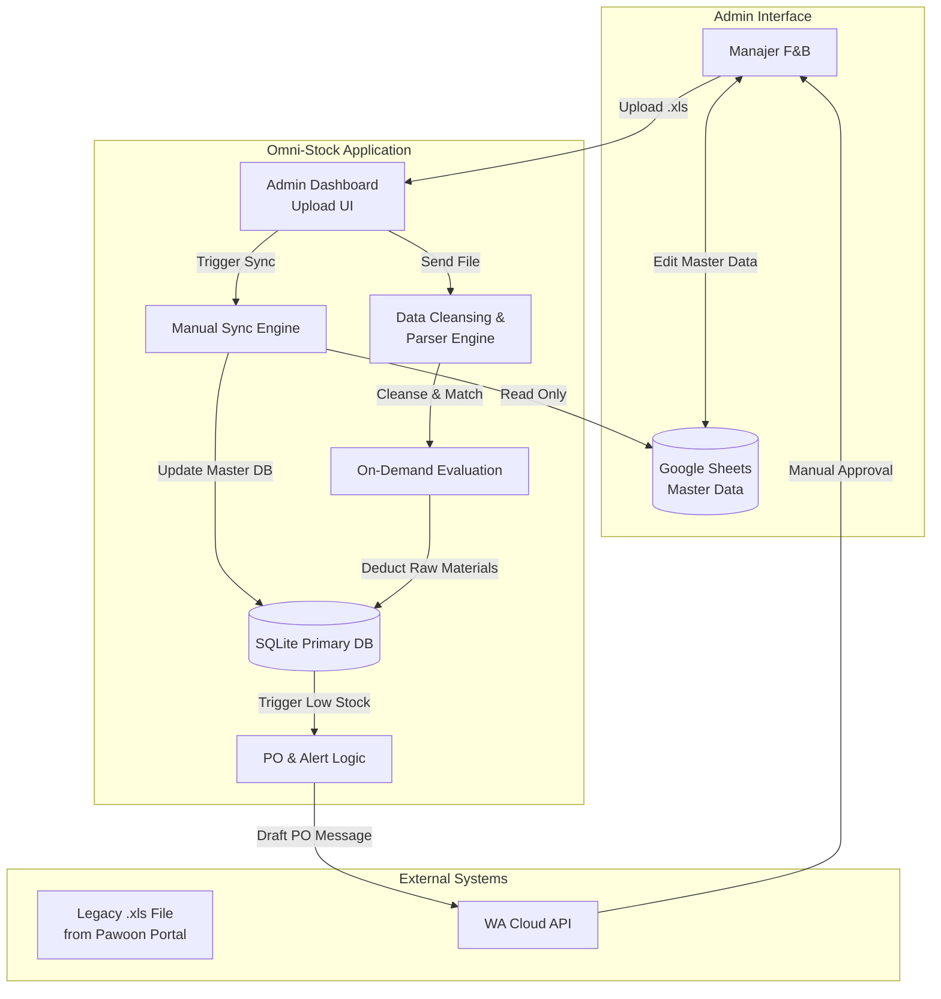
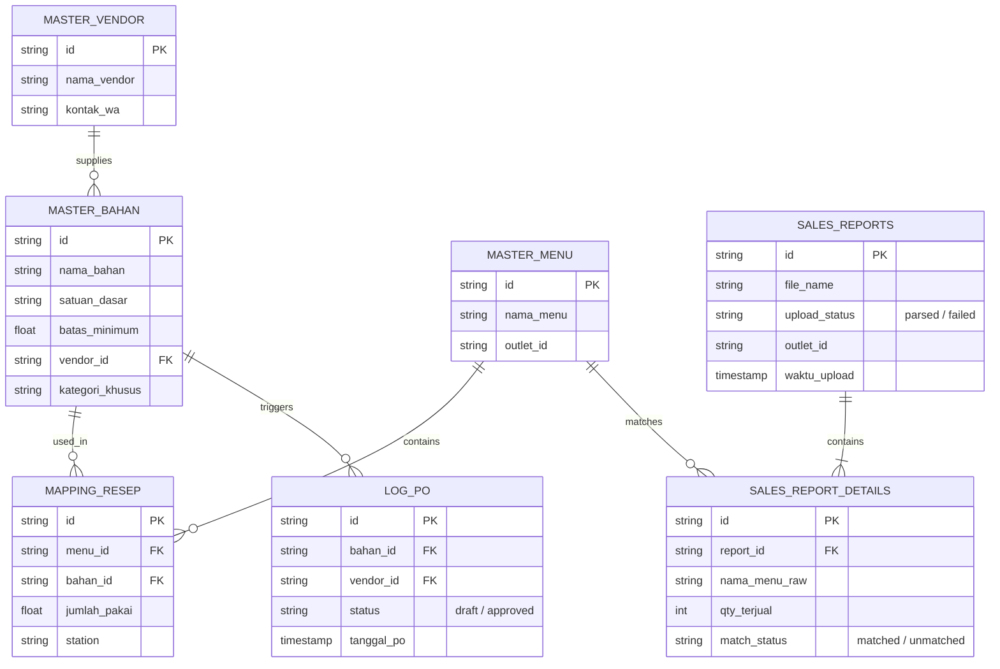

# PRD — Project Requirements Document

## 1. Overview
Manajemen stok F&B (Food & Beverage) multi-outlet seringkali terhambat oleh proses manual yang lambat, rentan salah hitung, dan berujung pada kehabisan atau penumpukan stok. **OMNI-STOCK (Kitchen Pulse)** hadir sebagai sistem otomasi manajemen inventaris yang memproses laporan penjualan melalui **Batch Processing upload laporan harian berformat .xls**. 

Sistem ini dirancang sangat ringan, handal, dan fleksibel untuk mengakomodasi keterbatasan integrasi API langsung pada beberapa jenis POS. Dengan pendekatan hibrida, sistem menggunakan Google Sheets yang familiar bagi Admin sebagai sumber data utama awal (Master Data), namun mengandalkan database internal (SQLite) yang cepat untuk komputasi data penjualan yang diunggah. Sistem akan melakukan parsing file legacy, pencocokan menu, dan pemotongan stok secara instan upon-upload, yang akhirnya bermuara pada pembuatan draf Purchase Order (PO) otomatis via WhatsApp.

## 2. Requirements
1.  **Data Ingestion via Manual Upload:** Sistem harus mendukung unggahan file laporan penjualan berformat legacy `.xls` (Excel 97-2003) melalui UI Dashboard. Sistem wajib menggunakan library khusus untuk membaca format biner ini.
2.  **Data Cleansing Parser (ETL):** Saat file `.xls` diunggah, sistem WAJIB melakukan proses pembersihan data: mengabaikan metadata/header di baris 1-7 (mulai baca tabel dari baris ke-8) dan melakukan fungsi `.trim()` untuk menghapus spasi berlebih pada kolom Nama Menu.
3.  **Single Source of Truth Secara Teknis:** Menggunakan SQLite + Drizzle ORM sebagai *Primary Database* untuk semua pencatatan laporan penjualan dan kalkulasi stok.
4.  **Exact String Matching:** Pemotongan stok berbasis kecocokan "Nama Menu" di file `.xls` dengan "Nama Menu" di database SQLite secara tepat (case-sensitive/trimed). Tidak ada ID matching karena keterbatasan data ekspor POS.
5.  **Integrasi Google Sheets Terukur:** Google Sheets **hanya** berfungsi sebagai UI Admin untuk mengelola *Master Data* (Bahan, Resep, Vendor, dll). Sistem hanya akan membaca Google Sheets ini melalui *Manual Trigger* (tombol sinkronisasi) untuk menghindari batasan *API Rate Limits*.
6.  **Isolasi Data Multi-Outlet:** Sistem harus mampu memisahkan laporan dan perhitungan stok antar cabang (outlet) hanya menggunakan teknik *Filter Kolom* pada database.
7.  **On-Demand Evaluation Engine:** Perhitungan pemotongan stok resep (dalam Gram/mL/Pcs) dilakukan secara instan (sinkron) tepat setelah file laporan berhasil di-parsing, bukan berjalan otomatis di background setiap jam.
8.  **Otomatisasi PO dengan Human-in-the-Loop:** Pemberitahuan stok menipis dan draf PO dikirim melalui Official WhatsApp Cloud API сразу setelah evaluasi upload selesai, namun membutuhkan persetujuan manual (Manual Approval) sebelum PO resmi berlanjut.
9.  **Bypass Barang Titipan:** Sistem harus otomatis mengabaikan barang berlabel "Kategori Khusus" (Consignment/Barang Titipan) dari logika kalkulasi resep.

## 3. Core Features
*   **Smart Batch Uploader (Dropzone):** UI Next.js Dashboard yang memungkinkan Manajer melakukan drag-and-drop file `.xls` Legacy Pawoon. Sistem akan memvalidasi format file sebelum diproses.
*   **Data Cleansing Parser:** Modul backend yang secara otomatis skip 7 baris pertama file Excel dan melakukan trim spasi pada kolom Nama Menu untuk memastikan kecocokan data.
*   **Master Data Sync Engine:** Fitur sinkronisasi manual yang menarik 6 *sheet* utama dari Google Sheets secara berkala (Master Vendor, Bahan, Menu, Resep, Stok Outlet, dan Log PO).
*   **On-Demand Inventory Evaluation Engine:** Dijalankan segera setelah upload selesai. Mesin ini akan membaca data penjualan dari file, memecah Menu menjadi detail Resep (Station Routing: Kitchen vs Bar), dan memotong stok bahan baku pada satuan dasarnya.
*   **Consignment Bypass Logic:** Sistem secara pintar akan melewati kalkulasi untuk produk-produk konsinyasi meskipun terdapat dalam laporan penjualan.
*   **Smart PO & WA Alerts:** Memantau batas minimum (threshold) stok setelah pemotongan selesai. Jika berada di batas kritis, sistem akan meracik draf PO berbasis vendor dan mengirimkannya langsung ke WhatsApp Manajer untuk di setujui.

## 4. User Flow
1.  **Persiapan Data:** Manajer memperbarui data Resep, Vendor, dan Bahan Baku di Google Sheets, lalu menekan tombol "Sync Data" di dashboard OMNI-STOCK.
2.  **Operasional Harian:** Kasir melakukan transaksi seperti biasa di mesin POS Pawoon. Data tersimpan lokal di POS.
3.  **Ekspor Laporan:** Di akhir shift atau harian, Manajer mengunduh laporan penjualan dari portal Pawoon dalam format file `.xls` (Legacy).
4.  **Upload & Parsing:** Manajer mengunggah file `.xls tersebut ke Dashboard OMNI-STOCK melalui fitur Dropzone. Sistem melakukan cleansing (skip header, trim spasi) dan pencocokan Nama Menu.
5.  **Kalkulasi Instan:** Segera setelah upload berhasil, sistem melakukan kalkulasi massal, memotong stok bahan tepung, sirup, atau telur berdasarkan menu yang terjual di file tersebut.
6.  **Notifikasi & PO:** Jika stok "Susu Segar" menipis setelah pemotongan, sistem mengirimkan pesan via WhatsApp ke Manajer berupa draf pesanan (PO) ke vendor penyedia susu.
7.  **Eksekusi PO:** Manajer mengklik "Setuju" pada pesan WhatsApp, log PO diperbarui di database, dan OMNI-STOCK siap untuk siklus upload berikutnya.

## 5. Architecture
Sistem dipisahkan menjadi dua alur utama: Alur pengelolaan Master Data (Admin via GSheets) dan Alur Transaksional (Upload File -> Parser -> DB -> WA).

## 6. Database Schema
Skema difokuskan pada SQLite. Isolasi antar outlet diatur menggunakan kolom `outlet_id`. Tabel transaksi diubah menjadi `SALES_REPORTS` untuk mencerminkan sifat batch upload.

**Daftar Tabel Utama:**
1.  **Master_Vendor:** Menyimpan informasi penyuplai bahan baku (ID, Nama, WA).
2.  **Master_Bahan:** Menyimpan daftar bahan mentah, satuan (Gram/mL), batas minimum stok, ID Vendor, mark kategori (untuk bypass Konsinyasi).
3.  **Master_Menu:** Menyimpan produk yang tersinkronisasi dari POS (termasuk Outlet ID) sebagai referensi pencocokan nama.
4.  **Mapping_Resep:** Tabel *junction* yang menghubungkan 1 Menu POS menjadi sekumpulan takaran Bahan Baku beserta lokasi distribusinya (Kitchen/Bar).
5.  **Sales_Reports:** Log unggahan file `.xls`. Memiliki status *`parsed`* saat berhasil diolah, mencatat waktu upload dan nama file.
6.  **Sales_Report_Details:** Detail baris penjualan dari file `.xls` yang sudah dibersihkan, menyimpan status kecocokan dengan Master Menu.
7.  **Log_PO:** Mencatat riwayat *Draft Purchase Order* yang ter-generate secara otomatis berkat stok yang menipis.

## 7. Tech Stack
Berdasarkan parameter performa dan keandalan, berikut adalah infrastruktur teknis yang akan digunakan:

*   **Frontend & Full-stack Framework:** Next.js (App Router)
*   **Styling & Komponen UI:** Tailwind CSS, shadcn/ui (Termasuk komponen Dropzone untuk upload)
*   **Backend & API Logics:** Next.js Server Actions & API Routes (untuk menangani upload dan parsing)
*   **Database:** SQLite (Relational DB cepat dan efisien)
*   **ORM (Object Relational Mapper):** Drizzle ORM (Performa sangat tinggi dan ramah TypeScript)
*   **Authentication:** Better Auth (Ringan dan komprehensif)
*   **Excel Parsing Library:** `xlsx` (npm package) - Wajib digunakan untuk mendukung format legacy binary `.xls` (Excel 97-2003).
*   **Deployment Strategy:** Railway (Direkomendasikan dibanding Vercel untuk menyimpan Database/SQLite volume persistent/External DB).
*   **Third-Party APIs:** 
    *   *Google Sheets API* (Read-only, manual trigger via *Google APIs Client Library*)
    *   *Official WhatsApp Cloud API* (Pengiriman Draf PO & balasan setuju)

## 8. Trigger PO Logic
*   **Timing:** Pengiriman draf PO ke WA Cloud API dipicu tepat setelah evaluasi file upload selesai (Syncronous post-upload).
*   **Condition:** Jika `Stok Saat Ini` < `Batas Minimum` setelah pemotongan stok berdasarkan file `.xls`.
*   **Action:** Sistem membuat entri `LOG_PO` dengan status `draft` dan mengirim pesan WhatsApp berisi ringkasan bahan yang perlu dipesan beserta vendor terkait.